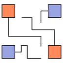

# Diagrams lets you draw the cloud system architecture in Python code

### [View all Roadmaps](https://github.com/nholuongut/all-roadmaps) &nbsp;&middot;&nbsp; [Best Practices](https://github.com/nholuongut/all-roadmaps/blob/main/public/best-practices/) &nbsp;&middot;&nbsp; [Questions](https://www.linkedin.com/in/nholuong/)



# Diagrams

[](/LICENSE)
[](https://badge.fury.io/py/diagrams)

[](https://www.tickgit.com/browse?repo=github.com/mingrammer/diagrams)


**Diagram as Code**.

Diagrams lets you draw the cloud system architecture **in Python code**. It was born for **prototyping** a new system architecture design without any design tools. You can also describe or visualize the existing system architecture as well. Diagrams currently supports main major providers including: `AWS`, `Azure`, `GCP`, `Kubernetes`, `Alibaba Cloud`, `Oracle Cloud` etc... It also supports `On-Premise` nodes, `SaaS` and major `Programming` frameworks and languages.

**Diagram as Code** also allows you to **track** the architecture diagram changes in any **version control** system.

>  NOTE: It does not control any actual cloud resources nor does it generate cloud formation or terraform code. It is just for drawing the cloud system architecture diagrams.

## Providers


## Getting Started

It requires **Python 3.7** or higher, check your Python version first.

It uses [Graphviz](https://www.graphviz.org/) to render the diagram, so you need to [install Graphviz](https://graphviz.gitlab.io/download/) to use **diagrams**. After installing graphviz (or already have it), install the **diagrams**.

> macOS users can download the Graphviz via `brew install graphviz` if you're using [Homebrew](https://brew.sh).

```shell
# using pip (pip3)
$ pip install diagrams

# using pipenv
$ pipenv install diagrams

# using poetry
$ poetry add diagrams
```

You can start with [quick start](https://diagrams.mingrammer.com/docs/getting-started/installation#quick-start). Check out [guides](https://diagrams.mingrammer.com/docs/guides/diagram) for more details, and you can find all available nodes list in [here](https://diagrams.mingrammer.com/docs/nodes/aws).

## Examples

| Event Processing                                             | Stateful Architecture                                        | Advanced Web Service                                         |
| ------------------------------------------------------------ | ------------------------------------------------------------ | ------------------------------------------------------------ |
|  |  |  |

You can find all the examples on the [examples](https://diagrams.mingrammer.com/docs/getting-started/examples) page.

## Contributing

To contribute to diagram, check out [contribution guidelines](CONTRIBUTING.md).

I'm are always open to your feedback.  Please contact as bellow information:
### [Contact ]
* [Name: nho Luong]
* [Skype](luongutnho_skype)
* [Github](https://github.com/nholuongut/)
* [Linkedin](https://www.linkedin.com/in/nholuong/)
* [Email Address](luongutnho@hotmail.com)


[](https://ko-fi.com/nholuong)

# License
* Nho Luong (c). All Rights Reserved.
